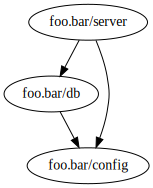

# igviz

Tiny library for visualizing an [integrant](https://github.com/weavejester/integrant) system.
The integrant equivalent of [system-viz](https://github.com/walmartlabs/system-viz).

## Usage

Dependency `[igviz "0.1.0"]`

```clojure
(ns foo.bar
  (:require
   [integrant.core :as ig]
   [madstap.igviz :as igviz]))

(def my-system
  {::config :foo
   ::db {:config (ig/ref ::config)}
   ::server {:db (ig/ref ::db)
             :config (ig/ref ::config)}})

(comment
  (igviz/visualize my-system)
  )
```

Which will be visualized like this:



Use of this project requires that [Graphviz](http://www.graphviz.org) is installed, which can be checked by running `dot -V` at the command line.  If it's not installed, you can do the following:

| platform | directions |
|----------|------------|
| Linux | install `graphviz` using your package manager |
| OS X | use `brew install graphiz` or [download the installer](http://www.graphviz.org/Download_macos.php) |
| Windows | [download the installer](http://www.graphviz.org/Download_windows.php) |

## Contributing

PRs and feature requests welcome.

## License

Copyright © 2018 Aleksander Madland Stapnes

Distributed under the Eclipse Public License either version 1.0 or (at
your option) any later version.
